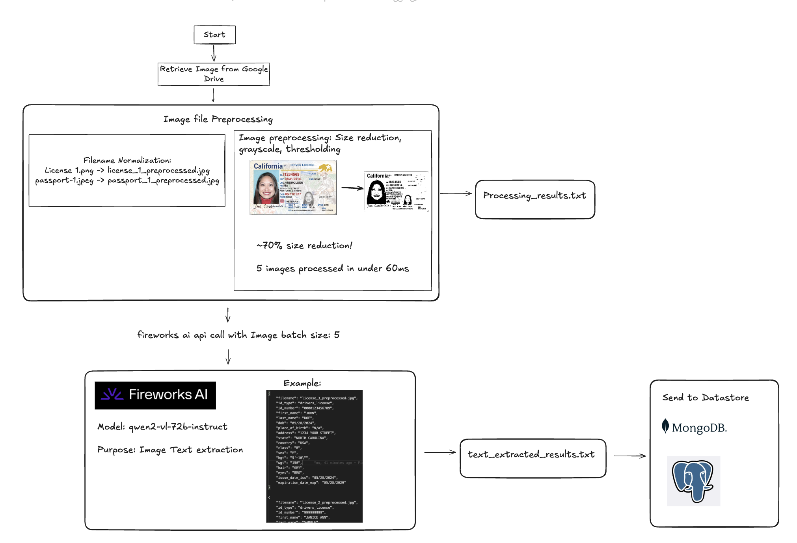
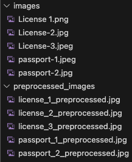
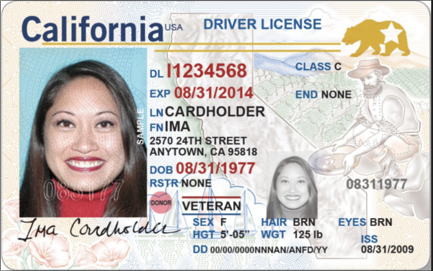
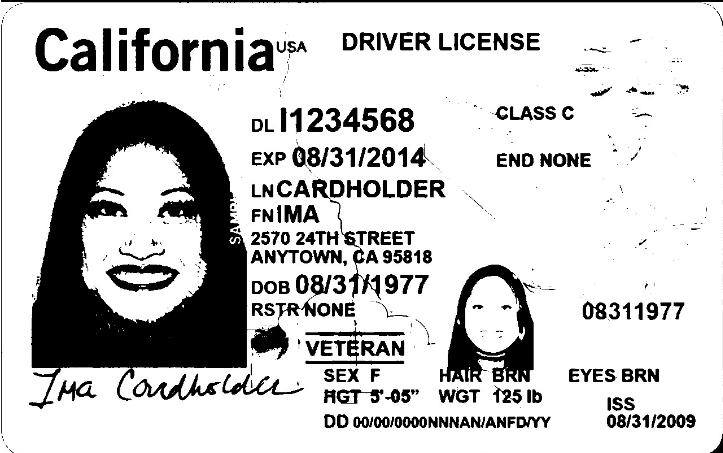

# Enterprise KYC Document Processing with Fireworks AI

[](LICENSE)
[]()


## Overview

This proof-of-concept (PoC) demonstrates a robust, scalable, and secure solution for KYC document processing. Our system transforms identity documents—such as driver's licenses and passports—into structured, searchable, and auditable data that seamlessly integrates into enterprise workflows. By automating the extraction of critical data with advanced model inference and intelligent batch processing, the solution minimizes manual entry, reduces human error, and drives significant cost savings using a serverless architecture.

## Why Fireworks AI?

Fireworks AI plays a pivotal role in streamlining our development and deployment process:

- **Platform Advantages:**  
  Its hosted environment, comprehensive documentation, and specialized endpoint for the Qwen2-vl-72b-instruct model dramatically reduce integration complexity and accelerate prototyping.

- **Token-Based Deployment Model:**  
  The platform’s flexible usage model ensures predictable costs while allowing rapid scalability to meet enterprise demands.

## Key Features

- **Secure & Compliant:**  
  Built with stringent security measures to handle sensitive personal data (PII) and ensure compliance with industry standards.

- **Operational Efficiency:**  
  Automates document processing to drastically reduce manual data entry and errors, leading to faster processing times.

- **Scalable Architecture:**  
  Leverages cloud-native, serverless, and container-based approaches to dynamically manage workloads and optimize costs.

- **Advanced OCR & Inference:**  
  Utilizes cutting-edge AI models (e.g., Qwen2-vl-72b-instruct) to deliver high accuracy in text extraction, supporting robust identity verification and KYC processes.

## Repository Structure
```plaintext
fireworks_kyc_data_extraction
├── 1_cv2_preprocess_and_stats.py
├── 2_text_extraction_batch_and_stats.py
├── LICENSE
├── README.md
├── images
│   ├── License 1.png
│   ├── License-2.jpg
│   ├── License-3.jpeg
│   ├── passport-1.jpeg
│   └── passport-2.jpg
├── media
│   ├── before_preprocessing_image_example.png
│   ├── demo_architecture.png
│   ├── filename_normalization.png
│   └── preprocessed_image_example.png
├── preprocessed_images
│   ├── license_1_preprocessed.jpg
│   ├── license_2_preprocessed.jpg
│   ├── license_3_preprocessed.jpg
│   ├── passport_1_preprocessed.jpg
│   └── passport_2_preprocessed.jpg
├── requirements.txt
└── results
    ├── processing_results.txt
    └── text_extracted_results.txt
```

## Installation & Setup

1. **Clone the Repository:**
   ```bash
   git clone git@github.com:insigh1/fireworks_kyc_data_extraction.git
   cd fireworks_kyc_data_extraction
   ```

## Set Up Your Environment:

Ensure you have Python 3.8+ installed.
Install required dependencies:
```
pip install -r requirements.txt
```

### Configure API Access:

Create an account on [Fireworks AI](https://fireworks.ai/) and obtain your API token. 

Modify the .env file and paste your Fireworks AI apikey here:
```
FIREWORKS_API_KEY=ENTER_YOUR_API_KEY_HERE
```

### Prepare Input Documents:

Place your identity document images in the images/ directory, or configure the script to download from the provided Google Drive link.

### Preprocess Images:

```bash
python 1_cv2_preprocess_and_stats.py
```

This script renames original files to a more normalized format.  


It also applies preprocessing techniques (resizing, grayscale, thresholding) to optimize images for OCR.  

Original Image: 



Preprocessed Image: 




Example output:
```bash
=== IMAGE PREPROCESSING RESULTS ===

Preprocessed: License 1.png
  - Original size: 2041757 bytes
  - Final size: 210508 bytes
  - Processing time: 22.30 ms

Preprocessed: License-2.jpg
  - Original size: 457331 bytes
  - Final size: 214732 bytes
  - Processing time: 6.66 ms

Preprocessed: License-3.jpeg
  - Original size: 771799 bytes
  - Final size: 146081 bytes
  - Processing time: 8.62 ms

Preprocessed: passport-1.jpeg
  - Original size: 157504 bytes
  - Final size: 249813 bytes
  - Processing time: 7.77 ms

Preprocessed: passport-2.jpg
  - Original size: 214108 bytes
  - Final size: 297394 bytes
  - Processing time: 5.06 ms


=== SUMMARY ===
Total images processed:          5
Total local preprocessing time:  0.0504 sec
Combined original size:          3642499 bytes
Combined final size:             1118528 bytes
Size reduced (absolute):         2523971 bytes
Size reduced (percentage):       69.29%
Total runtime (all steps):       59.37 ms
```

### Extract Text:

```bash
python 2_text_extraction_batch_and_stats.py
```

This script sends preprocessed images in batches to the Fireworks AI endpoint, retrieves the extracted text, and saves structured results.

Example output:
```bash
{
    "filename": "license_3_preprocessed.jpg",
    "id_type": "drivers_license",
    "id_number": "0000123456789",
    "first_name": "JOHN",
    "last_name": "DOE",
    "dob": "05/28/2024",
    "place_of_birth": "N/A",
    "address": "1234 YOUR STREET",
    "state": "NORTH CAROLINA",
    "country": "USA",
    "class": "B",
    "sex": "M",
    "hgt": "5'-10\"",
    "wgt": "150",
    "hair": "GRY",
    "eyes": "BRO",
    "issue_date_iss": "05/28/2024",
    "expiration_date_exp": "05/28/2029"
}

{
    "filename": "license_2_preprocessed.jpg",
    "id_type": "drivers_license",
    "id_number": "999999999",
    "first_name": "JANICE ANN",
    "last_name": "SAMPLE",
    "dob": "01/07/2005",
    "place_of_birth": "N/A",
    "address": "123 MAIN STREET APT. 1",
    "state": "PENNSYLVANIA",
    "country": "USA",
    "class": "C",
    "sex": "F",
    "hgt": "5'-05\"",
    "wgt": "125",
    "hair": "BLU",
    "eyes": "BLU",
    "issue_date_iss": "01/07/2022",
    "expiration_date_exp": "01/08/2026"
}

{
    "filename": "passport_1_preprocessed.jpg",
    "id_type": "passport",
    "id_number": "963545637",
    "first_name": "JOHN",
    "last_name": "DOE",
    "dob": "15 MAR 1996",
    "place_of_birth": "CALIFORNIA, U.S.A.",
    "address": "N/A",
    "state": "N/A",
    "country": "USA",
    "class": "N/A",
    "sex": "M",
    "hgt": "N/A",
    "wgt": "N/A",
    "hair": "N/A",
    "eyes": "N/A",
    "issue_date_iss": "14 APR 2017",
    "expiration_date_exp": "14 APR 2027"
}

{
    "filename": "passport_2_preprocessed.jpg",
    "id_type": "passport",
    "id_number": "575034801",
    "first_name": "BENJAMIN",
    "last_name": "FRANKLIN",
    "dob": "17 JAN 1706",
    "place_of_birth": "PROVINCE OF MASSACHUSETTS BAY, U.S.A.",
    "address": "N/A",
    "state": "N/A",
    "country": "USA",
    "class": "N/A",
    "sex": "M",
    "hgt": "N/A",
    "wgt": "N/A",
    "hair": "N/A",
    "eyes": "N/A",
    "issue_date_iss": "15 JAN 2018",
    "expiration_date_exp": "15 JAN 2028"
}

{
    "filename": "license_1_preprocessed.jpg",
    "id_type": "drivers_license",
    "id_number": "11234568",
    "first_name": "IMA",
    "last_name": "CARDHOLDER",
    "dob": "08/31/1977",
    "place_of_birth": "N/A",
    "address": "2570 24TH STREET",
    "state": "CALIFORNIA",
    "country": "USA",
    "class": "C",
    "sex": "F",
    "hgt": "5'-05\"",
    "wgt": "125 lb",
    "hair": "BRN",
    "eyes": "BRN",
    "issue_date_iss": "08/31/2009",
    "expiration_date_exp": "08/31/2014"
}


--- Performance & Design Statistics ---
Number of images processed: 5
Total number of API calls: 1
Total time for request: 20872.33 ms
Average time per image: 4174.47 ms

--- Usage / Token Statistics ---
  Prompt tokens: 5155
  Completion tokens: 1027
  Total tokens used: 6182
```

### View Results:

Logs and outputs are stored in the results/ directory for review.

